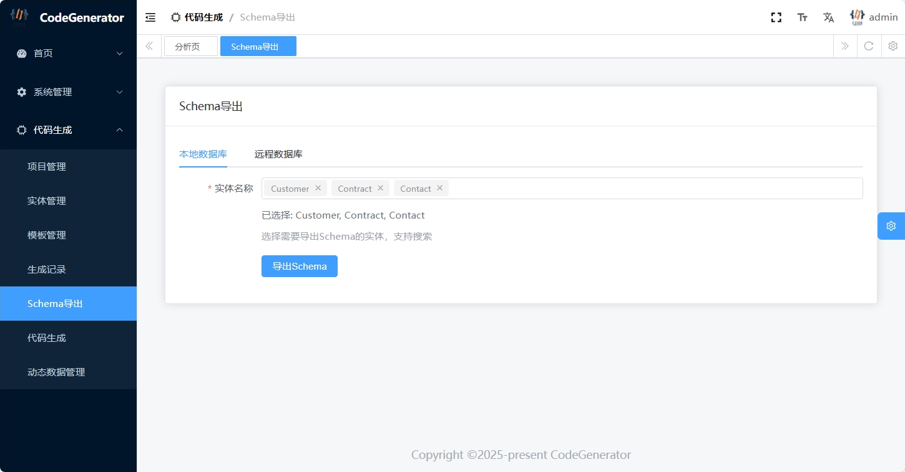

# CodeGenerator Pro - 专业的代码生成器解决方案

> [!IMPORTANT]
> ⚠️ 注意：此仓库仅包含前端部分代码
> 
> 前端项目基于 [vue-element-plus-admin](https://github.com/kailong321200875/vue-element-plus-admin) 开发，这是一个开箱即用的基于 element-plus 的后台管理系统模板。
> 
> 如需完整的前后端代码，请通过下方联系方式与作者联系。

## 🌟 项目简介

CodeGenerator Pro 是一个功能强大、灵活可扩展的代码生成器平台，专为开发者打造。它能显著提升开发效率，减少重复性工作，让您专注于业务逻辑的实现。

## ✨ 核心特性

### 🎯 模板驱动的代码生成
- 支持自定义代码生成模板，采用简单易学的Liquid模板语法
- 内置丰富的模板示例，快速上手
- 在线模板编辑器，实时预览生成效果

### 📊 数据库架构管理
- 支持导出数据库架构（表、列、外键）为JSON格式
- 灵活的数据库连接配置
- 在线更新表结构定义
- 支持多种主流数据库

### 🎨 项目管理系统
- 完整的项目生命周期管理
- 导入/导出数据库架构
- 导入/导出模板，模板库管理
- 代码生成历史记录追踪
- 在线预览与下载生成的代码

### 📱 动态数据管理
- 可视化数据库表浏览器
- 在线数据编辑与管理
- 灵活的数据库连接配置
- 可在线修改数据库表结构

### 🔐 安全性
- 基于AspNetCore Identity的用户认证
- 完善的角色权限管理
- 项目级别的访问控制

## 📸 功能展示

### 数据库架构管理

*数据库架构导出与管理界面 - 支持本地或远程数据库*

### 代码生成

*代码生成界面 - 支持在线预览和下载*

### 代码预览

*生成代码预览界面 - 支持多种编程语言*

### 项目管理

*项目管理界面 - 完整的项目生命周期管理*

### 模板编辑

*在线模板编辑器 - 支持实时预览*

### 生成文件编辑

*代码文件编辑器 - 支持多种语言语法高亮*

### 动态数据管理

*动态数据管理界面 - 支持在线数据操作和架构修改*

### 用户权限管理

*用户与权限管理 - 完善的角色权限控制*

## 🛠️ 技术栈

- **后端框架**: ASP.NET Core 8.0
- **ORM**: Entity Framework Core
- **模板引擎**: DotLiquid
- **对象映射**: AutoMapper
- **API文档**: Swagger/OpenAPI
- **数据库支持**: MySQL (可扩展)
- **身份认证**: JWT + ASP.NET Core Identity

## 💡 使用场景

- 快速构建项目基础架构
- 标准化团队开发流程
- 提升开发效率，减少重复工作
- 确保代码质量和一致性
- 简化数据库操作和管理

## 🚀 商业优势

- 显著提升开发效率，节省80%以上的基础代码编写时间
- 降低项目开发成本
- 提高代码质量和一致性
- 缩短项目交付周期
- 灵活的定制能力，满足不同场景需求

## 📦 获取与支持

- 💎 [专业版获取](链接)
- 📚 [详细文档](链接)
- 🤝 [技术支持](链接)
- 💬 [社区讨论](链接)

## 📄 授权说明

Copyright © 2024 小易软件 保留所有权利。

本软件为商业授权软件，未经授权不得用于商业用途。如需商业使用，请联系我们获取商业授权。

### 联系方式

- **作者QQ**: 1035716090

  

    
    
<i>QQ咨询</i>

  

- **微信**: 

  

    
    
<i>微信咨询</i>

  

*扫描上方二维码添加作者微信或QQ咨询授权事宜*

### 🤝 项目合作

小易软件专注于企业级应用开发，提供专业的软件开发服务：

- **项目外包**: 接受各类软件开发外包，交付有保障
- **技术支持**: 提供专业的技术咨询和解决方案
- **定制开发**: 根据企业需求定制开发各类管理系统
- **系统重构**: 专业的系统重构和性能优化服务

*欢迎通过以上联系方式垂询合作事宜*

---

欢迎关注项目更新，如果觉得项目对您有帮助，请给我们一个 ⭐️！ 